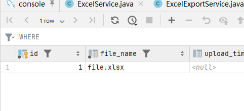

# 项目名称：Excel 数据处理系统

## 简介

本项目是一个基于 Spring Boot 和 MyBatis 的 Excel 数据处理系统。该系统支持 Excel 文件的导入和导出，并提供数据的过滤、清理、格式化等功能。项目还支持通用格式化、聚合查询和统计查询等高级功能。

---

## 功能展示

### 1. Excel 文件的导入
- 支持导入任意格式的 Excel 文件。
- 自动识别并处理多行表头、合并单元格。
- 在导入过程中，可以进行数据的过滤、清理和格式化操作。


- 首先准备一个待上传的EXCEL文件。
- 


- 打开网页，输入必要的参数，开始上传。注意起始行从0开始，列数则是从1开始。
- 


- 网页上方的popup窗口提示上传功能，则数据成功入库。
- 


- 我还没来及把ID和文件名做映射，先去数据表找刚刚上传的文件对应的ID。
- 


### 2. Excel 文件的导出
- 可以将处理后的数据导出为 Excel 文件。
- 导出过程中保留表头信息、单元格样式、合并单元格等。
- 拿着刚刚找到的ID，在下载模板的功能区里输入ID，然后下载。
  


- 一切正常的话，下载的文件就会出现在浏览器的下载里。
- 


- 源文件与导出的文件对比。
- 


### 3. 数据的通用格式化
- 支持合并相同项、居中显示等格式化操作。

### 4. 聚合查询与统计
- 支持按照中心、处域、项目组等维度进行聚合查询和统计分析。

---

## 使用说明

### 1. 环境配置

- **JDK**: 11 或以上版本
- **Maven**: 3.6+
- **MySQL**: 5.7+ (使用其他数据库需相应调整)

### 2. 数据库初始化

在 MySQL 数据库中创建所需的表结构。你可以使用项目中的 `schema.sql` 文件快速创建表结构。

```sql
create table excel_file (
    id bigint auto_increment primary key,
    file_name varchar(255) not null,
    upload_time timestamp default CURRENT_TIMESTAMP null,
    center varchar(255) null,
    department varchar(255) null,
    project_group varchar(255) null
);

create table header_info (
    id bigint auto_increment primary key,
    excel_file_id bigint not null,
    column_name varchar(255) not null,
    column_index int not null,
    row_index int not null,
    cell_style text null
);

create table data_info (
    id bigint auto_increment primary key,
    excel_file_id bigint not null,
    header_id bigint not null,
    sheet_no int not null,
    row_index int not null,
    column_index int not null,
    cell_value text null,
    cell_style text null,
    is_merged tinyint(1) default 0 null,
    merge_start_column int null,
    merge_end_column int null,
    merge_start_row int null,
    merge_end_row int null
);
```

### 3. 启动项目

使用 Maven 编译并启动项目：

```bash
mvn clean install
mvn spring-boot:run
```

访问 http://localhost:10000 进入系统。

### 4. 接口说明

- **上传 Excel 文件并处理**  
  URL: `/api/excel/upload`  
  Method: `POST`  
  参数: 
  - `file`: 上传的 Excel 文件
  - `startHeaderRow`: 表头开始行
  - `endHeaderRow`: 表头结束行
  - `startDataRow`: 数据开始行
  - `endDataRow`: 数据结束行
  - `columnCount`: 列数
  - `templateName`: 模板名称

- **下载处理后的 Excel 文件**  
  URL: `/api/excel/download`  
  Method: `GET`  
  参数: 
  - `excelFileId`: 已上传的 Excel 文件 ID

---

## 项目结构

```plaintext
├── src
│   ├── main
│   │   ├── java
│   │   │   └── tyj
│   │   │       └── excelbrandnew
│   │   │           ├── controller
│   │   │           ├── entity
│   │   │           ├── service
│   │   │           └── utils
│   │   └── resources
│   │       ├── mapper
│   │       └── application.properties
├── pom.xml
└── README.md
```

---

## 技术栈
  - `Spring Boot`: 应用程序框架
  - `MyBatis`: 数据库持久层框架
  - `MySQL`: 数据库
  - `Apache POI`: Excel 文件处理

---

## 贡献
欢迎通过 pull request 为本项目贡献代码！在提交前，请确保代码符合项目的编码规范，并且已通过所有测试。

---

## 许可证

本项目基于 [MIT License](LICENSE) 开源。

---

## 常见问题

### 1. 如何处理上传失败的情况？
检查上传的 Excel 文件是否符合格式要求，确保所有必填参数都已正确传递。

### 2. 如何处理导出文件时数据缺失的问题？
确保数据已正确存入数据库，并在导出时正确检索。可以通过日志排查是否有任何异常抛出。

### 3. 如何添加新功能？
可以根据项目需求，通过修改 `ExcelService` 或 `ExcelExportService` 类来添加新的功能或定制导入/导出逻辑。

---

## 参考文档

- [Spring Boot Documentation](https://docs.spring.io/spring-boot/docs/current/reference/htmlsingle/)
- [MyBatis Documentation](https://mybatis.org/mybatis-3/)
- [Apache POI Documentation](https://poi.apache.org/components/spreadsheet/quick-guide.html)
